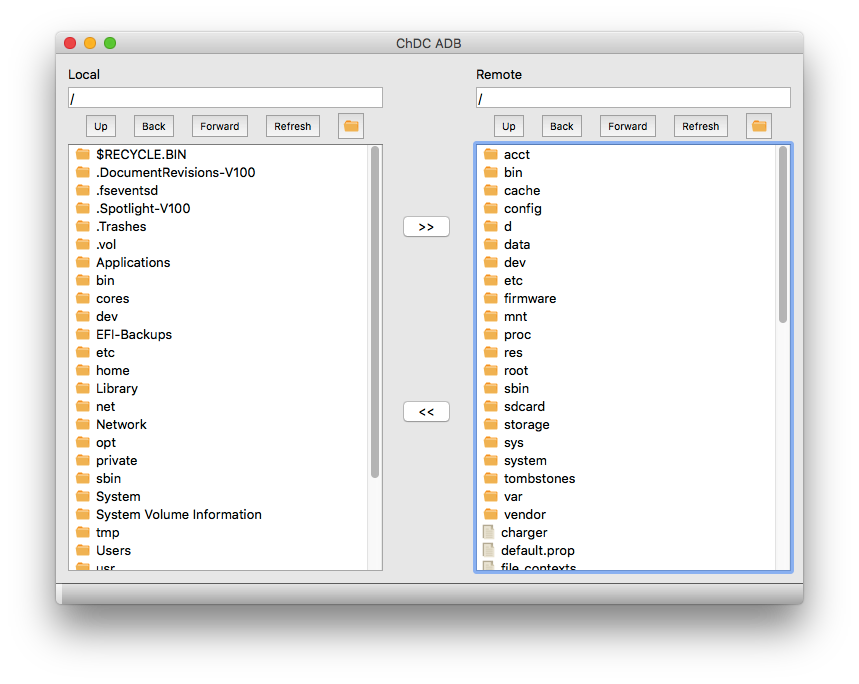

# ChDC ADB

在电脑上管理安卓手机的小程序。

## 程序界面

## 功能

* 安卓手机和电脑之间互传文件
* 不需要在安卓手机上安装任何 App 就可实现文件互传等功能

## 原理

基于 ADB(Android Debug Bridge) 之间的进程通信实现。

## 限制

* 需要打开手机的调试模式

## 测试及运行环境

| 程序或库   | 版本     |
| ------ | ------ |
| Python | 3.5    |
| PyQt   | 5.7    |
| adb    | 1.0.36 |

## 使用方法

将手机通过数据线插到电脑上，然后打开本程序即可。